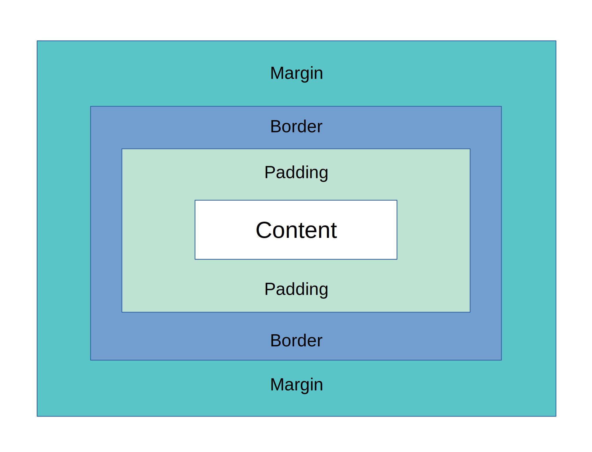
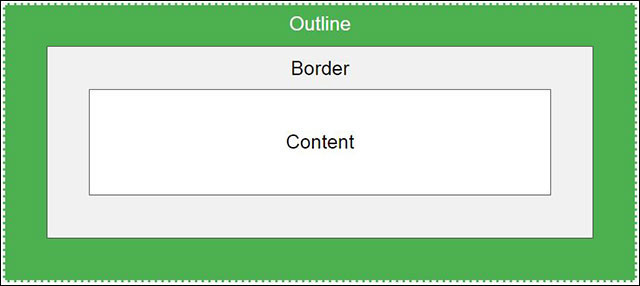

<div dir=”rtl”>

# HTML & CSS

## فهرست

* [مقدمه](#مقدمه)
* [ابزار مورد نیاز](#ابزار-مورد-نیاز)
* [لینک دانلود](#لینک-دانلود)
* [نحوه ساخت فایل html](#نحوه-ساخت-فایل-html)
* [نحوه ساخت فایل html در VS Code](#نحوه-ساخت-فایل-html-در-VS-Code)
* [شروع HTML](#شروع-html)
* [ساختار استاندار فایل HTML](#ساختار-استاندار-فایل-HTML)
* [فرم اصلی فایل HTML](#فرم-اصلی-فایل-HTML)
* [تگ p](#تگ-p)
* [نحوه تغییر عنوان صفحه](#نحوه-تغییر-عنوان-صفحه)
* [محیط های کدنویسی وب](#محیط-های-کدنویسی-وب)
* [تگ های heading](#تگ-های-heading)
* [تگ های brو hr](#تگ-های-brو-hr)
* [کامنت گذاری](#کامنت-گذاری)
* [تگ های bو i](#تگ-های-bو-i)
* [برخی از تگ های معناگرا](#برخی-از-تگ-های-معناگرا)
* [تگ های supو sub](#تگ-های-supو-sub)
* [لینک](#لینک)
* [عکس](#عکس)
* [لیست ها](#لیست-ها)
* [جدول](#جدول)
* [تفاوت تگ های inline و block](#تفاوت-تگ-های-inline-و-block)
* [فرم](#فرم)
* [فیلم](#فیلم)
* [صدا](#صدا)
* [تگ های داخل تگ head](#تگ-های-داخل-تگ-head)
* [یک سری نکته](#یک-سری-نکته)
* [شروع css](#شروع-css)
* [راه اهای نوشتن کد css](#راه-های-نوشتن-کد-css)
* [selector](#selector)
* [رنگ پس زمینه](#رنگ-پس-زمینه)
* [استایل دادن](#استایل-دادن)
* [کامنت گذاری در css](#کامنت-گذاری-در-css)
* [زنگ ها در css](#رنگ-ها-در-css)
* [عرض و ارتفاع در css](#عرض-و-ارتفاع-در-css)
* [بوردر](#بوردر)
* [استایل های متن](#استایل-های-متن)
* [حاشیه](#حاشیه)
* [استایل دادن به وضعیت های مختلف یک لینک](#استایل-به-وضعیت-های-مختلف-یک-لینک)
* [گوشه گرد](#گوشه-گرد)
* [تغییر بولت لیست ها](#تغییر-بولت-لیست-ها)
* [استایل دادن به جدول ها](#استایل-دادن-به-جدول-ها)
* [outline](#outline)
* [تبدیل تگ block به inline و برعکس](#تبدیل-تگ-block-به-inline-و-برعکس)
* [overflow](#overflow)
* [position](#position)
* [تغییر ترتیب تگ ها](#تغییر-ترتیب-تگ-ها)
* [شناور کردن تگ ها](#شناور-کردن-تگ-ها)
* [وضوح](#وضوح)
* [سایه](#سایه)
* [وسط قرار دادن تگ ها](#وسط-صفحه-قرار-دادن-تگ-ها)
* [فونت صفحات وب](#فونت-صفحات-وب)
* [عکس پس زمینه](#عکس-پس-زمینه)
* [گرادینت](#گرادینت)
* [انتقال استایل](#انتقال-استایل)
* [اندازه تگ هایی که عرض و ارتفاع مشخص دارند](#اندازه-تگ-هایی-که-عرض-و-ارتفاع-مشخص-دارند)
* [حذف کردن استایل های مرورگر ها](#حذف-کردن-استایل-های-مرورگرها)
* [فرق jpg و png](#فرق-jpg-و-png)
* [فایل بندی پروژه](#فایل-بندی-پروژه)

## مقدمه

:beginner:HTML

(Hyper Text Markup Language)

(زبان نشانه گذاری ابرمتن)

ساختار و اسکلت بندی:bone: صفحه‌ی وب است.

آخرین نسخه HTML5 ،HTML است.

زبان HTML زبان برنامه نویسی نیست، بلکه زبان نشانه گذاری و تگ گذاری است.<br><br>

:beginner:CSS

(Cascading Style Sheets)

(برگه های سبک آبشاری)

آخرین نسخه CSS3 ،CSS است.

زبان CSS زبان برنامه نویسی نیست بلکه مکمل فوق‌العاده:boom: برای HTML است.

## ابزار مورد نیاز

1. مرورگر (Firefox, chrome, opera,…)
2. محیط کدنویسی (Visual Studio Code, php storm,…)

## لینک دانلود

[مرورگر Firefox](https://www.mozilla.org/en-US/firefox/download/thanks/)

[محیط کدنویسی VS Code](https://code.visualstudio.com/download)

<details>

<summary>
نحوه فهمیدن اینکه ویندوزمان چند بیتی است
</summary>

1. به my computer می رویم.
2. روی بخش خالی صفحه راست کلیک کرده و روی گزینه properties کلیک می کنیم.
3. مقدار system type نشان می دهد سیستم:computer: شما چند بیتی است.

</details>

## نحوه ساخت فایل html
1. به محل و جایی:file_folder: که می خواهیم سند:pencil: را قرار دهیم می رویم.
2. راست کلیک و new و در نتیجه Text Document کلیک:computer_mouse: کنیم.
3. و سپس تغییر اسم و پسوند می دهیم (NAME.html, NAME.htm).
4. روی yes:white_check_mark: کلیک می کنیم.

:pushpin:بهتر است از پسوند .html استفاده کنیم.

<details>

<summary>
نمایش پسوند فایل ها
</summary>

1. بالا صفحه سربرگ view می رویم.
2. روی option کلیک می کنیم یا توی start سرچ می کنید folder option.
3. به سربرگ view رفته و تیک:ballot_box_with_check: Hide extensions for known file types بر می داریم.

</details>

<details>

<summary>
تغییر مرورگر پیش فرض
</summary>

1. کلیک راست روی برنامه و open with را می زنیم.
2. و روی choose another app کلیک:computer_mouse: می کنیم.
3. مرورگر مورد نطر را انتخاب کرده و تیک always use this app to open .html files بزنید و روی ok:ok_hand: کلیک کنید.

</details>

* نوشتن کد های html تو محیط کدنویسی است.
* نمایش نتیجه در مرورگر می باشد.

## نحوه ساخت فایل html در VS Code

1. محیط VS Code را باز می کنیم.
2. روی file، open folder:open_file_folder: می زنیم و به محلی که می خواهیم می رویم و select folder می زینم.
3. از sidebar  به explore  می رویم و روی new file کلیک کنیم (از طریق دکمه بالا یا راست کلیک روی sidebar).
4. و سپس تغییر اسم و پسوند:page_with_curl: می دهیم (NAME.html, NAME.htm).

## شروع HTML

در HTML با تگ های کار می کنیم.


- <><br>
تگ باز<br>
Opening tag<br>
- </><br>
تگ بسته<br>
Closing tag

:pushpin:بین <> Element name قرار می گیرد.

:pushpin:در بین تگ باز و بسته محتوا یا content قرار می گیرد.

:pushpin:بعضی از تگ ها تگ باز و بسته دارند، بعضی ها ندارند.

:pushpin:تگ ها می توانند تو در تو استفاده شوند.

## ساختار استاندار فایل HTML

```html
<html>
    <head>	
    </head>	
    <body>	
    </body>	
</html>
```

:pushpin:تگ های داخل تگ head مربوط به تنظیمات صفحه هستند.
:pushpin: تگ های داخل تگ body به کاربر نمایش داده می شوند.

<details>

<summary>
تغییر اندازه فونت در VS Code
</summary>

1. به File Preferences Setting می رویم.
2. از قسمت font size مقدار تغییر می دهیم.

</details>

<details>

<summary>
راحت تر نوشتن تگ های در VS Code
</summary>

در VS Code با نوشتن اسم تگ و فشار دادن دکمه tab تبدیل به تگ مورد نظر می شود.

```
html + press tab button => <html></html>
```

</details>

## فرم اصلی فایل HTML

به مرورگر باید بگید دارید از چی استفاده می کنید پس در خط اول می نویسیم

```html
<!DOCTYPE html>
```

:pushpin:دقت کنید که تگ فوق تگ بسته ندارد.

پس ساختار اصلی به فرم زیر می شود

```html
<!DOCTYPE html>
<html>
    <head>	
    </head>	
    <body>	
    </body>	
</html>
```
## تگ p

paragraph => p

:round_pushpin:برای نوشتن پاراگراف از تگ فوق استفاده می کنیم.

:round_pushpin: تگ p تگی است که کاربر می بیند، پس داخل تگ body نوشته می شود.

```html
<p></p>
```

:mega:برای نوشتن متن طولانی حتما از تگ p استفاده کنید، همین طوری داخل سند ننویسید. شاید ظاهری فرق نکند ولی از نظر موتور جستجو خیلی فرق می دارد.

:mega:در محیط کد زنی هر چه قدر داخل تگ enter p و space اضافه بزنیم هیچ تغییری در ظاهر نمی بینید.

## نحوه تغییر عنوان صفحه

داخل تگ head می رویم و عبارت زیر رو می نویسیم:arrow_down:

```html
<title>عنوان صفحه</title>
```

که بدین فرم در می آید

```html
<!DOCTYPE html>
<html>
	<head>
		<title>TITLE</title>	
	</head>
	<body>
	</body>	
</html>
```

## محیط های کدنویسی وب

- Text Editor<br>
:diamond_shape_with_a_dot_inside:Notepad, sublime, VS Code, nano,...

- IDE<br>
:diamond_shape_with_a_dot_inside:Php storm, web storm,...

:pushpin:با notepad هم می شود برای کار استفاده کرد ولی خیلی ساده است (و شایدم حوصله سر بر).

## تگ های heading

تگ های heading برای کاربر نمایش داده می شوند، پس داخل تگ body نوشته می شود .

که برای نوشتن عناوین از این تگ استفاده می شود.

تگ های h1, h2, h3, h4, h5, h6 را داریم که به ترتیب کوچک می شوند. (h1 بزرگتر از همه و h6 کوچکتر از همه است.)

```html
<h1></h1>
<h2></h2>
<h3></h3>
<h4></h4>
<h5></h5>
<h6></h6>
```

:small_red_triangle_down:مثال

```
h1: بررسی گوشی
	h2: مشخصات
		h3: دوربین
		h3: بدنه
```

این عنوان بندی برای موتور جستجو مهم است، به طوری که بیشترین اهمیت:100: به تگ h1 و کمتری اهمیت به h6 داده می شود.

<details>

<summary>
حذف منوی اسکرول افقی در VS Code
</summary>

1. به سربرگ view می رویم.
2. تیک toggle word wrap را می زنیم.

</details>

:pushpin:برای باز کردن یک فولدر داخل VS Code می توان آن را بگیریم و داخل محیط VS Code رها کنیم.

:pushpin:با کلیک روی دکمه های sidebar در  VS Code مخفی یا نمایش داده می شود.

## تگ های brو hr

برای رفتن به خط بعدی از تگ br استفاده می کنیم.

برای کشیدن خط افقی در صفحه از تگ hr استفاده می کنیم.

:pushpin:تگ brو hr تگ بسته ندارد.

```html
<br>
<hr>
```

:new_moon_with_face:نمایش فایل html بدون فایل CSS در مرورگر های مختلف ممکن است فرق کند و آنم به خاطر استایل های پیش فرض مرورگر هاست که به تگ های می دهند.

## کامنت گذاری

کامنت ها همه جا کاربرد دارند وهمه جا هستند و هیچ تغییری در ظاهر ایجاد نمی کنند، صرفا برنامه نویس آن ها را می بینند.

```html
<!-- TEXT -->
```

دلیل کامنت گذاری
- کامنت های برای مرور و توسعه بعدی توسط خودتات یا بقیه کاربرد دارند. (یادداشت و note)
- برای اینکه بخشی از کد رو نمایش ندهیم.

:pushpin:برای نمایش ندادن کد می توانیم آن را پاک کنیم ولی خیلی از جاها ممکن است دوباره به کد پاک شده نیاز پیدا کنیم، برای همین بهتر است بخش مدنظرمان را کامنت کنیم.

<details>

<summary>
کامنت گذاری سریع در VS Code
</summary>

هرجایی که خواستیم (اگه متنی می خواهید کامنت کنید، آن را انتخاب یا select کنید) ctrl را با / می زنید تا به کامنت تبدیل شود.

</details>

## تگ های bو i

:exclamation:از تگ b برای بولد و ضخیم کردن متن استفاده می کنیم.

:exclamation:از تگ i برای ایتالیک و مورب کردن متن استفاده می شود.

```html
<b></b>
<i></i>
```

تگ های فرمت دهی(مثل تگ bو i) رو می توان داخل تگ p یا به تنهایی استفاده کرد.

:pushpin:برای اینکه وسط متن راحت تگ بزارید متن موردنظر را cut کنید، بعدش تگ موردنظر باز و بسته کرده و متن رو داخل تگ جدید pate کنید.

اگر دو تا تگ پشت سرهم باز می شوند، مهم نیست کدام اول باز شود و کدام دوم ولی مهم است آن که که اول باز شده، آخر بسته شود و آن که دیرتر باز شده، زودتر بسته شود.

```html
درست
<b><i></i></b>

غلط
<b><i></b></i>
```

## برخی از تگ های معناگرا

:paperclip:تگ strong متن را بولد و ضخیم می کند و تگ معناگرا است.

:paperclip:تگ em متن را ایتالیک و مورب می کند و تگ معناگرا است.

:paperclip:تگ mark متن را هایلایت می کند و یک تگ معنادار است که به معنی این است که توجه کنید.

:paperclip:تگ del یک خط می کشد روی متن که معنادار بوده و به معنی این است که حذف شده و دیگر اعتبار ندارد.

:paperclip:تگ ins یک خط زیر متن می کشد که معنادار بوده و به این معنی است که این متن به تازگی اضافه شده است.

:paperclip:تگ blockquote یک تگ معناگرا است که برای نقل قول کردن استفاده می شود و از cite ،attribute برای قرار دادن لینک نقل قول استفاده می کنیم.

:paperclip:تگ q یک تگ معناگرا است که برای نقل قول استفاده می شود و در مرورگر داخل "" نمایش داده می شود.

:paperclip:تگ abbr برا اینکه بگویم کلمه مخفف یه کلمه دیگه است و از title ،attribute برای گفتن کلمه کامل آن استفاده می کنیم.

:paperclip:تگ address برای آدرس دادن (مکان، تلفن:phone:، ایمیل:e-mail:، نام و ...) استفاده می شود.


```html
<strong></strong>
<em></em>
<mark></mark>
<del></del>
<ins></ins>
```

تگ معناگرا (semantic elements or tags) به موتور جستجو:mag: و مرورگر پیام می دهد که این متن مهم است و توجه کنید.

## تگ های supو sub

:fleur_de_lis:تگ sup برای بالا بردن متن (حالت توان) استفاده می شود.

:fleur_de_lis:تگ sub برای پایین آوردن متن (حالت اندیس) استفاده می شود.

```html
<sup></sup>
<sub></sub>
```
## لینک

لینک ها در HTML ما را از یک صفحه:page_facing_up: به صفحه:page_facing_up: دیگر می برند.

از تگ a برای ساخت لینک:paperclip: استفاده می کنیم.

برای کامل کردن لینک در داخل تگ باز a بعد از حرف a فاصله می زنیم و می نویسیم href=”ADRESS” که به آن attribute گفته می شود.(ADDRESS مسیری است که در نظر داریم که باید جایگزین شود.)

:paperclip:اگر آدرسی را نمی دانید به جاش # قرار دهید.

```html
<a href=”https://google.com”>Click Me</a>
```

برای باز کردن لینک در صفحه جدید در attribute ها target=”_blank” قرار می دهیم که مقدار پیش فرض آن _self است.

```html
<a href=”https://google.com” target=”_black”></a>
```

برای راهنما و گذاشتن یک متن که با نگه داشتن:point_up_2: روی لینک نمایش داده شود، باید در attribute های تگ a مقدار title=”TEXT” قرار دهیم.(TEXT متن مدنظر شما است که باید جایگزین شود.)

```html
<a href=”https://google.com” title=”hello”></a>
```

برای رفتن به صفحه بعدی در لوکال و سیستم:computer: شخصی خودمان از طریق لینک کافی است در href آدرس فایل:file_folder: را بهش بدهیم.

```html
<a href=”test.html”></a>
```

<details>

<summary>
نحوه مسیردهی
</summary>

برای رفتن یه فولدر یا پوشه:open_file_folder: جلو برای آدرس دهی فایل در لینک (مثلا اسم فایل mehdi) به صورت زیر عمل می کنیم.

:arrow_forward:href=”mehdi/test.html”

برای رفتن یه فولدر یا پوشه:open_file_folder: عقب برای آدرس دهی فایل در لینک به صورت زیر عمل می کنیم.

:arrow_forward:href=”../test.html”

از دو مورد فوق می توان باهم استفاده کرد.

:arrow_forward:href=”../mehdi/test.html”

</details>

با استفاده از لینک ها می توان به قسمت های مختلف همان صفحه نیز رفت، برای این کار کافی است به قسمتی که باید برود به تگش id:id: بدهیم و در قسمت href لینک "#اسم ای دی" را قرار دهیم.

```html
<a href=”#part7”>Go to Seven</a>
<p id=”part7”></p>
```

ساخت لینک برای ایمیل:e-mail: زدن

```html
<a href=”mailto:EMAILADDRESS></a>
```

(در کد بالا به جای EMAILADDRESS آدرس ایمیل مدنظر باید قرار بگیرید و جاگرین شود.)

ساخت لینک:link: به شماره تلفن:telephone_receiver:

```html
<a href=”tel:PHONENUMBER”></a>
```

(در کد بالا به جای PHONENUMBER شماره تلفن مدنظر باید قرار بگیرید و جاگرین شود.)

## عکس

برای قرار دادن عکس:city_sunset: در فایل html از تگ img استفاده می کنیم و از attribute، src برای مشخص کردن مسیر عکس اسنفاده می کنیم.

```html

```

بعضی مواقع به دلیل سرعت نت یا پاک شدن عکس از روی سرور عکس نمایش داده نمی شود. برای همین از attribute، alt استفاده می کنیم تا در صورت عدم نمایش، آن متن نمایش داده شود.

```html

```

حتما alt ،attribute استفاده کنید چون کاربر موضوع بفهمد و در عین حال برای موتور جستجو:mag: بسیار مهم است.

<details>

<summary>
گرفتن لینک:link: عکس از اینترنت
</summary>

روی عکس در مرورگرتان کلیک:computer_mouse: راست کرده و copy image location یا copy image link کلیک می کنیم.

حالا اگر آدرس عکسی که از نت گرفتید را در src قرار بدید، برای شما عکس در صفحه تان اگر به نت وصل باشید نمایش داده می شود.

:boom:بهتر است عکس ها را دانلود کرده و از لوکال خودتان آدرس دهی کنید.

</details>

برای مشخص کردن انداره عکس از width ،attribute برای عرض و height برای ارتفاع استفاده می کنیم.

واحد پیش فرض برای اندازه گیری:straight_ruler: پیکسل است.

اگر از یکی از width ،attribute یا height استفاده کنیم، عکس به یک نسبت بزرگ یا کوچک می شود.

:pushpin:لینک دادن به عکس

```html
<a href=”ADDRESS” target=”NEW_PAGE_OR_NOT”></a>
```

## لیست ها

در HTML دو نوع لیست داریم

1. Unordered list
2. Ordered list

برای لیست نامرتب یا Unordered list از تگ ul استفاده می کنیم که برای هر آیتم از لیست از تگ li استفاده می شود.

```html
<ul>
    <li></li>
</ul>
```

برای تغییر شکلک ها در لیست ها از CSS استفاده می کنیم.

برای لیست مرتب یا ordered list از تگ ol استفاده می کنیم که برای آیتم ها از تگ li استفاده می کنیم.

```html
<ol>
    <li></li>
</ol>
```

برای تغییر عدد و شکلک پشت آیتم ها از type ،attribute در تگ ol استفاده می کنیم که شامل 1, a, A, i, I می شود و مقدار پیش فرض آن 1 است.

```html
<ol type="i">
    <li></li>
</ol>
```

از لیست ها می توان به صورت تو در تو نیز استفاده کرد.

```html
<ul>
    <li>Hello</li>
    <li>
        <ol>
            <li>ali</li>
            <li>reza</li>
        </ol>
    </li>
    <li>bye</li>
    <li>ali
        <ul>
            <li>ali</li>
            <li>reza</li>
        </ul>
    </li>
</ul>
```

:pushpin:حتما فاصله و تو رفتگی ها داخل کدنویسی رعایت کنید.

<details>

<summary>
مرتب سازی خودکار کد ها در VS Code
</summary>

یکی از دو راه زیر را انجام دهید

- از روی صفحه کیبورد:keyboard: ctrl + shift + p را برنید و بعد بنویسید format document
- از روی صفحه کیبورد:keyboard: alt + shift + f را بزنید.

</details>

در HTML لیست توضیحی هم داریم ولی کاربردی نیست.

```html
<dl>
	<dt>Book</dt>
	<dd>Something we read</dd>
	<dt>TV</dt>
	<dd>Something we watch</dd>
</dl>
```

:bell:سعی کنید خودتان به سوالاتتان برسید و جواب بدید و هیچ کاری آسان نیست، پس اگر به مشکل می خورید تسلیم نشوید.

## جدول

از تگ table برای کشیدن جدول استفاده می کنیم.

از تگ tr برای ساخت سطر و برای ساخت سلول از تگ td استفاده می کنیم.

برای ساخت header از تگ th استفاده می کنیم.

```html
<table>
	<tr>
		<th>Name></th>
		<th>Job</th>
	</tr>
	<tr>
		<td>Alireza</td>
		<td>programmer</td>
	</tr>
</table>
```

:star2:برای یکی کردن چند تا سلول که در یک ستون قرار دارد، در تگ td از rowspan=”NUMBER” ،attribute استفاده می کنیم و NUMBER تعداد سطر یکسان است.

```html
<table>
    <tr>
        <th>Month</th>
        <th>Savings</th>
        <th>Savings for holiday!</th>
    </tr>
    <tr>
        <td>January</td>
        <td>$100</td>
        <td rowspan="2">$50</td>
    </tr>
</table>
```

:star2:برای یکی کردن چند تا سلول که در یک سطر قرار دارد، در تگ td از colspan=”NUMBER” ،attribute استفاده می کنیم و NUMBER تعداد ستون یکسان است.

```html
<table>
    <tr>
        <th>Month</th>
        <th>Savings</th>
    </tr>
    <tr>
        <td colspan="2">Sum: $180</td>
    </tr>
</table>
```

:diamonds:از تگ table به تازگی در ساخت صفحات وب استفاده نمی شود.

:star2:از تگ caption بعد از تگ باز table برای توضیح دادن و عنوان جدول استفاده می کنیم.  

```html
<table>
    <caption>Monthly savings</caption>
    <tr>
        <th>Month</th>
        <th>Savings</th>
    </tr>
    <tr>
        <td>January</td>
        <td>$100</td>
    </tr>
</table>
```

## تفاوت تگ های inline و block

به تگ هایی که کل یک سطر را آشغال می کنند تگ های block گفته می شود. مثل تگ p

به تگ هایی که کل یک سطر را اشغال نمی کنند تگ های inline گفته می شود مثل تگ b 

تگ div برای دسته بندی:card_index_dividers: بود و تگ block است.

تگ span برای دسته بندی:card_index_dividers: بود و تگ inline است.

## فرم

تگ form برای ساخت فرم استفاده می شود.

از تگ input برای گرفتن ورودی استفاده می شود که از type ،attribute برای تعیین نوع آن استفاده می کنیم که یک تگ inline است.

برای ساخت دکمه submit از کد زیر استفاده می کنیم.

```html
<input type=”submit” value=”TEXTOFBUTTON”>
```

:safety_pin:(به جای TEXTOFBUTTON متنی که می خواهیم داخل دکمه نمایش داده شود را جایگزین می کنیم.)

به متن هایی که قبل از input قرار می دهیم label می گویند.

برای نوشتن label به طوری به که با کلیک روی متن input مدنظر انتخاب شود به صورت زیر عمل می کنیم

1. یک تگ label باز و بسته کرده و در بین آن متن دلخواه مان را می نویسیم.
2. از for ،attribute برای اسم دادن به label استفاده می کنیم.
3. به تگ input متناظر همان اسمی که به for دادیم را به عنوان id قرار می دهیم.

```html
<label for=”TEXT”>name: </label>
<input type=”text” id=”TEXT”>
```

از action ،attribute در تگ فرم برای فرستادن اطلاعات بعد از زدن دکمه submit استفاده می کنیم که نیاز به زبان برنامه نویسی مثل php, python, … است.

دیگر attribute تگ method ،form است که دو مقدار GET و POST می گیرد.

اگه مقدار target ،attribute در تگ form را مساوی _blank باشد، submit کد در صفحه جدید اتفاق می افتد.

فرم ها در حالت پیشفرض حالت autocomplete دارند یعنی متن های قبلی را برای کامل کردن متن به ما پیشنهاد می دهند که برای برداشتن در تگ form مقدار autocomplete ،attribute را مساوی off قرار می دهیم. همین اتفاق را با قرار داخل تگ input هم می توان رغم زد.

```html
<form action="/action_page.php" method="post" autocomplete="off">
    <label for="fname">First name:</label><br>
    <input type="text" id="fname" name="fname" value="John"><br>
    <input type="submit" value="Submit">
</form>
```

مقدار مرسوم type ،attribute

1. text: متن
2. password: رمز (کلمات معلوم نیست)
3. submit: دکمه تایید و ارسال اطلاعات فرم
4. reset: دکمه برای خالی کردن اطلاعات فرم
5. email: برای گرفتن ایمیل (مثل متن است با این تفاوت که برای ایمیل نامعتبر خطا می دهد)
6. number: فقط مقدار عددی می پذیرد
7. url: برای ورودی گرفتن آدرس کامل
8. color: برای گرفتن رنگ از کاربر
9. file: برای آپلود فایل و گرفتن فایل از کاربر
10. hidden: برای گرفتن و فرستادن اطلاعات که لازم نیست کاربر بداند مثل id کاربر

اگر مقدار type مساوی submit یا reset باشد با استفاده از value ،attribute می توان متن داخل دکمه را تغییر داد.

وقتی type=”number” باشد دو تا attribute دیگر هم می توانیم استفاده کنیم که min و max است که بازه عدد ورودی را مشخص می کند.

```html
<input type="text">
<input type="password">
<input type="submit" value="TEXT">
<input type="reset" value="TEXT">
<input type="email">
<input type="number" min="NUMBER" max="NUMBER">
<input type="url">
<input type="color">
<input type="file">
<input type="hidden">
```

:safety_pin:(به جایی TEXT متنی می خواهید و به جای NUMBER عددی که مدنظرتان هست را قرار می دهید و جایگزین می کنید.)

از value ،attribute برای قراردهی اولیه فیلد ها استفاده می کنیم.

```html
<input type="text" vlue="TEXT">
```

:safety_pin:(به جای TEXT متن مدنظرتان را جایگزین می کنید.)

اگه به تگ input readonly ،attribute بدهیم دیگه قابل تغییر نیست و فقط قابل کپی کردن است.

```html
<input type="text" readonly>
```

اگه به input disable ،attribute بدهیم غیرفعال می شود و قابل کپی کردن نیست.

```html
<input type="text" disable>
```

از size ،attribute برای مشخص کردن تعداد کاراکتر ورودی کاربر استفاده می کنیم.

```html
<input type="text" size="NUMBER">
```

:safety_pin:(به جای NUMBER عدد مدنظرتان را جایگزین می کنید.)

از maxlength ،attribute برای مشخص کردن حداکثر تعداد کاراکتر ورودی کاربر استفاده می کنیم.

```html
<input type="text" maxlenght="NUMBER">
```

:safety_pin:(به جای NUMBER عدد مدنظرتان را جایگزین می کنید.)

از placeholder ،attribute برای نوشتن متن راهنمایی استفاده می کنیم.

```html
<input type="text" placeholder="TEXT">
```

:safety_pin:(به جای TEXT متن مدنظرتان را جایگزین می کنید.)

اگه به input required ،attribute بدهیم پر شدنش لازم می شود و در هنگام submit نمی تواند خالی باشد.

```html
<input type="text" required>
```

اگه به input autofocus ،attribute بدهیم وقتی صفحه بالا می آید به صورت پیش فرض انتخاب شده است.

```html
<input type="text" autofocus>
```

:fleur_de_lis:از radio button وقتی استفاده می کنیم از چند تا حالت فقط حق انتخاب یک مورد را داریم. مثل جنسیت، سن و...

برای داشتن radio button از input با type=”radio” استفاده می کنیم. برای اینکه radio button هایی که در یک گروه هستند باهم باشند باید name ،attribute یکسانی داشته باشند.

```html
<input type="radio" id="html" name="fav_language" value="HTML">
<label for="html">HTML</label><br>
<input type="radio" id="css" name="fav_language" value="CSS">
<label for="css">CSS</label><br>
<input type="radio" id="javascript" name="fav_language" value="JavaScript">
<label for="javascript">JavaScript</label>
```

:fleur_de_lis:از checkboxes وقتی که امکان انتخاب چند مورد وجود داشته باشد استفاده می کنیم. مثل لیست خرید، علاقه مندی ها و...

برای داشتن checkboxes از input با type=”checkbox” استفاده می کنیم. برای اینکه checkbox هایی که در یک گروه هستند باهم باشند باید name ،attribute یکسانی داشته باشند.

```html
<input type="checkbox" id="vehicle1" name="vehicle1" value="Bike">
<label for="vehicle1"> I have a bike</label><br>
<input type="checkbox" id="vehicle2" name="vehicle2" value="Car">
<label for="vehicle2"> I have a car</label><br>
<input type="checkbox" id="vehicle3" name="vehicle3" value="Boat">
```

:fleur_de_lis:برای داشتن select option از تگ select استفاده می کنیم. 

بهتر است برای تگ attributes ،select های name و id را کامل کنیم.

برای قرار دادن لیستی از آیتم ها در تگ select از تگ option استفاده می کنیم.

یادتون نره برای تگ option value ،attribute را پر کنید.

```html
<select name="cars" id="cars">
    <option value="volvo">Volvo</option>
    <option value="saab">Saab</option>
    <option value="opel">Opel</option>
    <option value="audi">Audi</option>
</select>
```

مقدار پیش فرض select option اولین option است ولی اگه به یکی از option ها selected ،attribute را بدهیم به عنوان مقدار پیش فرض select option قرار می گیرد.

```html
<select name="cars" id="cars">
    <option value="volvo">Volvo</option>
    <option value="saab" selected>Saab</option>
</select>
```

اگر بخواهیم مقدار پیش فرض نداشته باشه یک option با متن "--انتخاب کنید--" اول از همه اضافه می کنیم.

```html
<select name="cars" id="cars">
    <option value="not_select">--انتخاب کنید--</option>
</select>
```

اگر به تگ select، attribute multiple بدهیم امکان انتخاب چند تایی داریم که به جاش بهتر است از checkbox ها استفاده کنیم.

```html
<select name="cars" id="cars" multiple>
    <option value="volvo">Volvo</option>
    <option value="saab">Saab</option>
    <option value="opel">Opel</option>
    <option value="audi">Audi</option>
</select>
```

:fleur_de_lis:از تگ textarea برای محیط متنی که قابلیت تغییر سایز دارد استفاده می کنیم. که attributes cols تعداد ستون و عرض را و attributes rows تعداد ردیف و ارتفاع را نشان می دهد.

دارای attribute placeholder نیز هست.

```html
<textarea id="TEXT" name="TEXT" rows="NUMBER" cols="NUMBER" placeholder="TEXT"></textarea>
```

:safety_pin:(به جایی TEXT متنی می خواهید و به جای NUMBER عددی که مدنظرتان هست را قرار می دهید و جایگزین می کنید.)

:fleur_de_lis:از تگ button برای دکمه استفاده می کنیم که از نوع block است. که هم بیرون و هم داخل تگ form قابل استفاده است.

```html
<button type="button" onclick="alert('Hello world!')">Click Me!</button>
```

:fleur_de_lis:از تگ fieldset استفاده می کنیم تا یه تقسیم بندی داخل فرم داشته باشیم.

برای عنوان دادن به filedset از تگ legend در خط بعدی تگ باز filedset استفاده می کنیم.

```html
<form action="/action_page.php">
 <fieldset>
  <legend>Personalia:</legend>
  <label for="fname">First name:</label>
  <input type="text" id="fname" name="fname"><br><br>
  <label for="lname">Last name:</label>
  <input type="text" id="lname" name="lname"><br><br>
  <label for="email">Email:</label>
  <input type="email" id="email" name="email"><br><br>
  <label for="birthday">Birthday:</label>
  <input type="date" id="birthday" name="birthday"><br><br>
  <input type="submit" value="Submit">
 </fieldset>
</form>
```

## فیلم

فرمت های فیلمی که توسط html5 پشتیبانی می شوند شامل mp4, WebM, Ogg است.

از تگ video برای اضافه کردن فیلم:clapper: استفاده می کنیم.

```html
<video controls>
	<source src=”PATH” type=”video/VIDEO_TYPE”>
</video>
```

(به جای PATH مسیر فیلم مدنظر و به جای VIDEO_TYPE فرمت فیلم را قرار دهید و جایگرین کنید.)

اگر داخل تگ video متنی بنویسیم در صورتی که فایل پشتیانی نشود و برای کاربر نمایش داده نشود این متن نمایش داده می شود.

برای تغییر اندازه ابعاد فیلم داخل تگ video از width ،attribute و height استفاده می کنیم.

## صدا

فرمت های صدایی که توسط html5 پشتیبانی می شوند شامل mp3, wav, ogg است.

از تگ audio برای اضافه کردن صدا:loud_sound: استفاده می کنیم.

```html
<audio controls>
	<source src=”PATH” type=”audio/AUDIO_TYPE”>
</audio>
```

:safety_pin:(به جای PATH مسیر صدا مدنظر و به جای AUDIO_TYPE فرمت صدا را قرار دهید و جایگرین کنید.)

اگر داخل تگ audio متنی بنویسیم در صورتی که فایل پشتیانی نشود و برای کاربر نمایش داده نشود این متن نمایش داده می شود.

## تگ های داخل تگ head

قبلا گفتیم برای عنوان دادن به صفحه از تگ title داخل تگ head استفاده می کنیم.

می توانیم از تگ style برای استایل و کد های css استفاه می کنیم.

از تگ link برای لینک:link: های فایل های css به فایل html استفاده می کنیم.

از تگ script برای نوشتن کد های js استفاده می کنیم.

تگ meta برا تنظیمات	:gear: هست.

اگر صفحه وب شما فارسی:iran: است باید در تگ meta مقدار charset=”UTF-8” ،attribute قرار می دهیم.

برای فهماندن نوع سایت مان به موتور های جستجو:mag: باید به صورت زیر عمل کنیم.

```html
<meta name=”keyword” content=”WORDS”>
```

:safety_pin:(به جای WORDS کلمات کلیدی را قرار می دهیم و با ',' از هم جداشان می کنیم)

برای توضیح دادن:page_with_curl: صحات وب به صورت زیر عمل می کنیم.

```html
<meta name=”description” content=”SENTENCE”>
```

:safety_pin:(به جای SENTENCE جمله خلاصه ای در مورد سایت مان قرار می دهیم.)

برای مشخص کردن نویسنده:black_nib: صفحه به صورت زیر عمل می کنیم.

```html
<meta name=”author” content=”NAME”>
```

:safety_pin:(به جای NAME اسم نویسنده را قرار می دهیم.)

## یک سری نکته

:label:هیچ وقت

```html
<!DOCTYPE html>
```

یادتان نرود.

:label:بزرگ و کوچک نوشتن تگ فرق ندارد ولی بهتر است کوچک نوشته شوند.

:label:به باز و بسته بودن تگ ها دقت کنید.

:label:در بخش attribute تگ ها با اینکه فرق ندارد ولی حروف را کوچک بنویسید.

:label:مقدار مساوی attribute را حتما داخل ‘’ یا “” قرار دهید.

:label:سعی کنید attribute هایی که بعد از زدن alt براتان می آورد را پر کنید.

:label:برای عکس در تگ img حتما یک از attribute های width یا height را پر کنید.

:label:تگ title و meta را فراموش نکنید.

:label:فاصله اضافه الکی نزنید.

:label:اسم فایل، عکس، صدا و ... را حتما به صورت کوچک و برای جدا کردند به جای فاصله از - یا _ استفاده کنید.

:label:به جای حفظ کردن کد ها یاد بگیرید از آن ها چه طوری استفاده کنید و ذهن تان را خالی بزارید برای فکر کردن روی مسائل و پیدا کردن راه حل مناسب و کارآمد و هرجایی که گیر کردید یا نمی دانستید سرچ کنید

:label:برخی از سایت های مناسب برای مطالعه و سرچ کردن

- [W3school](https://www.w3schools.com/)
- [stackoverflow](https://stackoverflow.com/)

<details>

<summary>
نصب قالب در VS Code
</summary>

در بخش extension که در sidebar قرار دارد اسم قالب خودمان را سرچ می کنیم و روی install می زنیم.

قالب پیشنهادی: atom one dark

با سرچ می توانید قالب های دیگری نیز پیدا و استفاده کنید.

</details>

<details>

<summary>
تغییر قالب در VS Code
</summary>

از روی صفحه کیبورد Ctrl + shift + t را می زنیم و می نویسم >color و enter را می زنیم و بین قالب ها آن که می خواهیم انتخاب می کنیم.

</details>

<details>

<summary>
تغییر فونت در VS Code
</summary>

فونت را با کلیک راست روی ایکنش و سپس زدن روی install روی سیستم مان نصب می کنیم.

بعد داخل VS Code به قسمت File->preferences->settings می رویم و از بخش editor: font family اسم فونت موردنظر را جایگزین می کنیم.

فونت پیشنهادی: Cascadia(مخصوص برنامه نویسی)

</details>

<details>

<summary>
نصب آیکن در VS Code
</summary>

در بخش extension که در sidebar قرار دارد اسم آیکن خودمان را سرچ می کنیم و روی install می زنیم.

آیکن پیشنهادی: Vscode-icons

با سرچ می توانید آیکن های دیگری نیز پیدا و استفاده کنید.

</details>

<details>

<summary>
نصب افزونه در VS Code
</summary>

در بخش extension که در sidebar قرار دارد اسم افزونه خودمان را سرچ می کنیم و روی install می زنیم.

افزونه های پیشنهادی:

- HTML Snippets
- IntelliSense for CSS class names in HTML

با سرچ می توانید افزونه های دیگری نیز پیدا و استفاده کنید.

</details>

## شروع CSS

مخفف cascading style sheet است.

:thinking:زبان برنامه نویسی نیست بلکه زبان استایل دهی است.

به ما کمک می کند که نمایش کد های html را مشخص کنیم و مکمل خوبی برای html است.

:boom:معمولا اسم فایل css پروژه مان را style.css می گذاریم.

## راه های نوشتن کد CSS

1. ساختن فایل CSS و لینک کردن آن به فایل html (external)
2. استفاده از تگ style در داخل تگ head (internal)
3. استفاده از style ،attribute در تگ ها (inline)

:sparkles:برای لینک کردن فایل html و css داخل تگ head از تگ link استفاده می کنیم.

```html
<link rel=”stylesheet” href=”ADDRESS/style.css”>
```

(به جای ADDRESS محل فایل style.css را قرار دهید.)

:sparkles:برای نوشتن چند خصیصه در حالت inline ; می زاریم و همه کد ها رو پشت سر هم داخل یک خط می نویسیم.

:sparkles:روش inline برای دادن یک استایل های کوچک به یک تگ داخل صفحه کاربرد دارد.

## selector

```css
ٍُSELECTOR{
}
```

به چیزی که قبل از { است selector می گویند و هر چی داخل {} است attributes می گویند.

, به معنی "و" در css است.

h1, h2 یعنی h1 و h2 باهم یک استایلی داشته باشند.

## رنگ پس زمینه

برای دادن رنگ پس زمینه:red_square: در CSS از خصیصه backgrand-color استفاده می کنیم.

```css
body{
    background-color: red;
}
```

## استایل دادن

:small_red_triangle_down:اگر به کل تگ ها می خواهید بدهید اسم آن تگ را به عنوان selector می نویسید.

```css
body{
}

a{
}

p{
}
```

:small_red_triangle_down:انتخاب تگ خاص برای استایل دادن

1. به تگ موردنظر یک کلاس خاص می دهیم.
2. به فایل css می رویم و برای بخش selector ".اسمی" که نوشته بودیم را می نویسیم.
3. کروشه را باز و بسته می کنیم و کد های خودمان را می نویسیم.

به هیچ عنوان . یادتان نره.

```css
.header{
}

.content{
}
```

, برای کلاس ها هم قابل استفاده است.

:small_red_triangle_down:به جای کلاس از id هم می توانیم استفاده کنیم. فقط به جای  . از # استفاده می کنیم.

```css
#image{
}

#title{
}
```

:small_red_triangle_down:کلاس به تگ های مختلف داده می شود ولی id را به یک تگ باید داد.

می شود از یک id چند جا استفاده کرد ولی استاندار نیست.

## کامنت گذاری در CSS

```css
/* بخشی که کامنت می شود */
```

:white_check_mark:اگر بخشی از کد را انتخاب کنیم و ctrl + / را در VS Code بزنیم کامنت می شود.

## رنگ ها در CSS

1. یه سری رنگ خاص داریم . red, green, yellow, ...
2. کد hex
3. rgb

پیدا کردن کد hex رنگ ها با سرچ color picker یا استفاده از نرم افزار های گرافیکی امکان پذیر است.

:x:هیچ وقت # قبل از نوشتن کد hex فراموش نشود.

فرم rgb(NUMBER, NUMBER, NUMBER) بدین صورت است که شامل 3 عدد بین 0 تا 255 می شود و به ترتیب مقدار قرمز:red_circle:، سبز:green_circle: و آبی:large_blue_circle: بودن را مشخص می کند.

:fleur_de_lis:برای انتخاب رنگ می توانید :mag:[flat color](https://www.google.com/search?q=flat+color) و :mag:[material ui](https://www.google.com/search?q=material+ui) را سرچ کنید.

## عرض و ارتفاع در CSS

برای مشخص کردن عرض از خصیصه width استفاده می کنیم.

برای مشخص کردن ارتفاع از خصیصه height استفاده می کنیم.

:interrobang:یادتان نرود معیار اندازه گیری را مشخص کنید. فعلا فقط px برای پیکسل می دانیم.

```css
.mydiv{
    width: 200px;
    height: 300px;
}
```

<details>

<summary>
سریع نوستن تگ یا کلاس یا ای دی خاص در VS Code
</summary>

:beginner:کلاس

TAGNAME.CLASSNAME

(به جای TAGNAME تگ موردنظر و به جای CLASSNAME اسم کلاس موردنظر را می نویسید)

بعد از نوشتن عبارت فوق کلید tab را می زنید و تگ با کلاس مدنظر ساخته می شود.

:beginner:ای دی

TAGNAME#IDNAME

(به جای TAGNAME تگ موردنظر و به جای IDNAME اسم ای دی موردنظر را می نویسید)

بعد از نوشتن عبارت فوق کلید tab را می زنید و تگ با ای دی مدنظر ساخته می شود.

</details>

## بوردر

:fleur_de_lis:با خصیصه border-style استایل بوردر را مشخص می کند.

با خصیصه border-top-style استایل بوردر سمت بالا را مشخص می کند.

با خصیصه border-left-style استایل بوردر سمت چپ را مشخص می کند.

با خصیصه border-right-style استایل بوردر سمت راست را مشخص می کند.

با خصیصه border-bottom-style استایل بوردر سمت پایین را مشخص می کند.

که اگر بهش مقدار solid را بدهیم خط ساده برایمان می کشد.

اگر بهش مقدار dotted را بدهیم نقطه برایمان می کشد.

اگر بهش مقدار dashed را بدهیم خط های فاصه دار برایمان می کشد.

اگر بهش مقدار double را بدهیم دو خطی برایمان می کشد.

اگر بهش مقدار groove را بدهیم حالت قاب برایمالن می کشد.

و بقیه مقادیر مثل ridge, inset, outset,…

:o:اگر none بدهیم بوردر پاک می شود.

```css
div{
    border-top-style: solid;
    border-left-style: dotted;
    border-bottom-style: groove;
    border-right-style: inset;
}
```

:fleur_de_lis:با خصیصه border-color رنگ بوردر را برایمان مشخص می کند.

با خصیصه border-top-color رنگ بوردر سمت بالا را برایمان مشخص می کند.

با خصیصه border-left-color رنگ بوردر سمت چپ را برایمان مشخص می کند.

با خصیصه border-right-color رنگ بوردر سمت راست را برایمان مشخص می کند.

با خصیصه border-bottom-color رنگ بوردر سمت پایین را برایمان مشخص می کند.

```css
div {
  border-top-color: coral;
  border-left-color: red;
  border-bottom-color: green;
  border-right-color: blue;
}
```

:fleur_de_lis:با خصیصه border-width ضخامت بوردر را نمایش می دهد.

با خصیصه border-top-width ضخامت بوردر سمت بالا را نمایش می دهد.

با خصیصه border-left-width ضخامت بوردر سمت چپ را نمایش می دهد.

با خصیصه border-right-width ضخامت بوردر سمت راست را نمایش می دهد.

با خصیصه border-bottom-width ضخامت بوردر سمت پایین را نمایش می دهد.

```css
div{
    border-top-width: 20px;
    border-left-width: 2px;
    border-bottom-width: 5px;
    border-right-width: 10px;
}
```

:fleur_de_lis:می توانیم به border-width, border-style, border-color همزمان 4 تا مقدار بدهیم که به صورت TOP RIGHT BOTTOM LEFT(ساعتگرد) اعمال می شود.

می توانیم به border-width, border-style, border-color همزمان 2 تا مقدار بدهیم که به صورت TOP_AND_BOTTOM RIGHT_AND_LEFT(بالا پایین و چپ راست) اعمال می شود.

اگر برای چپ مقداری مشخص نکنیم از روی راست استایل ها را می گیرد.

به جای همه border-width, border-color, border-style می توانیم از border استفاده کنیم که اولش اندازه، بعدش استایل و در آخر رنگ  (SIZE STYLE COLOR) را بهش می دهیم.

همچنین border-left, border-right, border-top, border-bottom داریم که فقط برای یک سمت استایل ها را تنظیم می کند.

```css
div{
    border-top: 20px solid coral;
    border-left: 2px dotted red;
    border-bottom: 5px groove green;
    border-right: 10px inset blue;
}
```

## استایل های متن

:low_brightness:به وسیله خصیصه color رنگ متن:clipboard: را تغییر می دهیم.

:low_brightness:با خصیصه text-align برای محل قرار گرقتن متن است که مقادیر آن left, right, center, justify است که پیش فرض آن left است.

:low_brightness:با خصیصه font-size اندازه و سایز فونت را تعیین می کنیم. مشخص کردن معیار اندازه گیری را فراموش نکنید.

:low_brightness:اگر متن:file_cabinet: فارسی و انگلیسی باشد ترتیب به هم می خورد پس بهش direction می دهیم. که برای فارسی مقدارش را برابر rtl و برای انگلیسی که به صورت پیش فرض نیز هست ltr قرار می دهیم.

* rtl: right to left
* ltr: left to right

```css
p{
    color: red;
    direction: rtl;
    text-align: center;
}
```

:warning:برای اینکه در سایت های فارسی متن فارسی و انگلیسی درست باشد به تگ body این خصیصه را می دهند تا مشکلی پیش نیاید.

:low_brightness:خصیصه text-decoration برای تغییر حاضر متن است.

مقدارش اگر underline باشد یک خط زیر متن می کشد.

مقدارش اگر line-through باشد یک خط روی متن می کشد.

مقدارش اگر overline باشد یک خط بالا متن می کشد.

مقدارش اگر none باشد همه خط ها را پاک می کند.

:bangbang:مقدار none برای پاک کردن خط زیر لینک ها کاربرد دارد.

:radioactive:بعضی از این کار ها را هم با css می شود اعمال کرد هم با تگ ها ولی فرق اینا در بحث سیگنال فرستادن به موتور های جستجو است که تگ این کار را انجام می دهند. 

:low_brightness:خصیصه text-transform حالت حروف را در متن مشخص می کند.

اگر مقدار مساوی lowercase باشد همه حروف کوچک هستند.

اگر مقدار مساوی uppercase باشد همه حروف بزرگ هستند.

اگر مقدار مساوی capitalize باشد حروف اول همه کلمات بزرگ، بقیه حروف کوچک هستند.

```css
p{
    text-transform: lowercase;
}
```

:low_brightness:خصیصه text-indent مقدار فرورفتگی اول هر پاراگراف را مشخص می کند.

:low_brightness:خصیصه letter-spacing مقدار فاصله بین حروف را مشخص می کند.

:low_brightness:خصیصه line-height فاصله بین خطوط را مشخص می کند.

:low_brightness:خصیصه word-spacing فاصله بین کلمات را مشخص می کنند.

:low_brightness:با font-weight می توانیم ضخامت فونت را تغییر بدهیم که برای بولد کردن مقدارش را مساوی bold قرار می دهیم.


```css
p{
    text-indent: 10px;
    letter-spacing: 2px;
    line-height: -2px;
    word-spacing: -10px;
    font-weight: bold;
}
```

:low_brightness:خصیصه text-shadow سایه متن را مشخص می کند.

2 تا عدد می گیرد. اولین عدد سایه عمومی و عدد بعدی سایه افقی است.

عدد سومی که می توانیم بهش بدهیم میزان بلور شدن سایه است.

و در آخر رنگ سایه را مشخص می کنیم.

با سرچ :mag:[text shadow generator](https://www.google.com/search?q=text+shadow+generator) می توانیم سایه متن را راحت بسازیم. 

:bangbang:فرق rgba با rgb در این است که rgba یک عدد چهارمی بین 0 و 1 دارد که opacity را نشان می دهد.

## حاشیه

:star:با خصیصه margin فاصله از بیرون را مشخص می کنیم.

همچنین margin-top, margin-left, margin-right, margin-bottom داریم.

:star:با خصیصه padding فاصله از داخل را مشخص می کنیم.

همچنین padding-top, padding-left, padding-right, padding-bottom داریم.

نحوه مقدار دهی که border ها داشتیم برای margin و padding هم استفاده می شود.

```css
div{
    margin: 10px 20px 30px 40px;
    padding: 10px 20px 30px 40px;
}

p{
    margin: 10px 20px 30px;
    padding: 10px 20px 30px;
}

a{
    margin: 10px 20px;
    padding: 10px 20px;
}

li{
    margin: 10px;
    padding: 10px;
}
```

<p align="center" width="100%">



</p>

:zap:می توانید برای درک بهتر box model را بررسی کنید.

## استایل به وضعیت های مختلف یک لینک

```css
a:hover{
}
```

:point_up:برای استایل دادن وقتی که موس می رود روی لینک استفاده می شود.

```css
a:visited{
}
```

:point_up:برای استایل دادن به لینک هایی که رویشان قبلا کلیک کردیم.

```css
a:active{
}
```

:point_up:برای استایل دادن به لینک ها وقتی رویشان کلیک کردیم.


## گوشه گرد

:star:خصیصه border-radius برای گرد کردن گوشه ها استفاده می شود.

مثل border قابل مقدار دهی می شود.

```css
div{
    border-radius: 1px 2px 3px 4px;
}

.mydiv{
    border-radius: 1px 2px 3px;
}

#navigation{
    border-radius: 1px 2px;
}

a{
    border-radius: 1px;
}
```

:bell:اگر یک استایلی بین یک سری تگ یکسان است بهتر است به صورت مشترک و یک جا نوشته شوند تا اینکه همه جا قرار دهیم.

```css
SELECTORONE SELECTORTWO{

}
```

:black_nib:این یعنی برو داخل SELECTORONE دنبال SELECTORTWO باش و آن ها را انتخاب کن.

## تغییر بولت لیست ها

برای تغییر علامت قبل li در ul از خصیصه list-style-type استفاده می کنیم که مقدار disc, circle, square, … می گیرد.

:no_entry:برای ol هم داریم ولی مقداریش فرق می کند.

برای دادن عکس به عنوان علامت قبل li ها از list-style-image استفاده می کنیم و از طریق url(“ADDRESS”) مسیر عکس را می دهیم.

(به جای ADDRESS آدرس عکس را قرار می دهیم.)

:radioactive:لیست ها به صورت پیش فرض margin و padding دارند.

## استایل دادن به جدول ها

:warning:از border-collapse: collapse استفاده می کنیم تا بودر هایی که می شود به هم بچسبند را به هم می چسباند و یکی کنیم.

:warning:برای اینکه یکی در میان با سطر های جدول کار کنیم به صورت زیر عمل می کنیم

```css
tr:nth-child(odd){
    /* استایل سطر های فرد */
}

tr:nth-child(even){
    /* استایل سطر های زوج */
}
```

## outline

دقیقا مثل border است ولی بعد از آن قرار می گیرد و مثل border تعریف می شود.

```css
div{
    outline: 10px solid #4CAF50;
}
```

<p align="center" width="100%">



</p>

## تبدیل تگ block به inline و برعکس

یک سری تگ ها inline و یه سری دیگر block هستند.

برای تبدیل تگ های inline به block و برعکس از خصیصه display استفاده می کنیم.

:no_entry:موردی که باید بهش توجه کنید این است که margin و height روی تگ های inline اعمال نمی شوند.

برای رفع این مشکل display را روی inline-block می زاریم.

```css
span{
    display: block;
}
```

و اگر مقدارش برابر none قرار دهیم حذف می شود.

:exclamation:فرق display: none و visibility:hidden در این است که در اولی کامل حذف می شود ولی در دومی جاش هست و نمایش داده نمی شود.

## overflow

مقدار پیش فرض overflow برابر visible است.

اگر متن طولانی باشد از جایی که در برمی گیرد بیرون می زند که اگر به تگ دربرگیرنده ش overflow: hidden داده شود، چیزی که سرریز می کند و بیرون می زند را نمایش نمی دهد.

اگه مقدار overflow مساوی scroll باشد آن متنی که بیرون می زند حالت اسکرول می گیرد که هم اسکرول عمودی می گیرد و هم افقی.

برای اینکه فقط اسکرول عمودی داشته باشیم مقدار را مساوی auto قرار می دهیم.

```css
div{
    width: 200px;
    height: 300px;
    overflow: hidden;
}
```

:bangbang:این خصیصه فقط روی تگ های بلاکی با طول و عرض مشخص اعمال می شود.

## position

مقدار تعیین موقعیت المان در حالت پیش فرض static است.

که برای تعیین موقعیت از 4 خصیصه top, bottom, right, left استفاده می کنیم.

:fleur_de_lis:relative

نسبت به حالتی که در حالت عادی دارد تغییر می کند.

:fleur_de_lis:fixed

همیشه یک جا(یک وضعیت و موقعیت ثابت در کل صفحه حتی با اسکرول) قرار می گیرد.

:white_check_mark:مناسب ساخت دکمه شناور برای صفحات اجتماعی می باشد.

:fleur_de_lis:absolute

نسبت به اولین پدری که position غیر static داشته باشد تعیین می شود.

:fleur_de_lis:sticky

وقتی به آن تگ می رسیم در موقعیتی که تعیین کردیم نسبت به صفحه نمایش قرار می گیرد.

:white_check_mark:مناسب درست کردن هدر چسبیده می باشد.

```css
div{
    position: relative;
    top: 0;
    right: 30px;
}
```

## تغییر ترتیب تگ ها

:name_badge:در حالت عادی تگ ها نسبت به ترتیب قرار گیریشان در فایل hmtl نمایش داده می شوند برای تغییر این ترتیب از z-index استفاده می کنیم.

هر چی عدد بزرگ تر رو تر قرار می گیرد.

```css
p{
    z-index: 4;
}
```

## شناور کردن تگ ها

:name_badge:برای شناور کردن تگ ها از خصیصه float استفاده می کنیم که 3 تا مقدار دارد right, left, none را می گیرد.

مقدار پیش فرض آن none است.

```css
#mydiv{
    float: left;
}
```

## وضوح

:name_badge:برای تغییر وضوح تگ ها از خصیصه opacity استفاده می کنیم.

مقدار آن بین 0 تا 1 است.

```css
img{
    opacity: 0.5;
}
```

## سایه

:recycle:برای سایه دادن به هرچیزی غیر از متن از box-shadow استفاده می کنیم.

:recycle:برای متن از text-shadow استفاده می کنیم.

مقداردهیش مثل text-shadow است با کمی تفاوت.

عدد اول سایه در حالت افقی را نشان می دهد.

عدد دوم سایه در حالت عمودی را نشان می دهد.

عدد سوم میران بلور شدن سایه را نشان می دهد.

عدد چهارم میزان پخش شدن سایه را نشان می دهد.

و اخر هم رنگ سایه را نشان می دهد.

برای ساخت راحت box-shadow می توانید داخل نت سرچ کنید :mag:[box shadow generator](https://www.google.com/search?q=box+shadow+generator)

## وسط صفحه قرار دادن تگ ها

:pushpin:قرار دادن المان بلاکی در وسط صفحه

1. عرض المان را مشخص می کنیم.
2. بهش خصیصه margin: auto قرار می دهیم.

```css
div{
    width: 200px;
    margin: auto;
}
```

:pushpin:برای وسط قرار دادن متن از text-align: center استفاده می کنیم.

وسط قرار دادن المان inline

1. عرض المان را مشخص می کنیم.
2. بهش خصیصه margin: auto قرار می دهیم.
3. و مقدار را مساوی display: block قرار می دهیم.

```css
span{
    width: 300px;
    margin: auto;
    display: block;
}
```

:pushpin:راه دیگر برای کار فوق دادن text-align: center به تگ پدر است.

## فونت صفحات وب

اگه فونت خاصی استفاده می کنید باید داخل فایل ها بگید و گرنه برای دیگران نماش داده نمی شود.

برای اضافه کردن باید از font-face استفاده کنیم.

از فونتی استفاده کنید که نسخه وب داشته باشد.

:bangbang:برای اینکه از یک فونت خاص استفاده کنیم باید 4 فرمت از آن را داشته باشیم که عبارت است از eot, ttf,woff, woff2 است.

معمولا یک پوشه به اسم font درست می کنیم و فونت ها را انجا قرار می دهیم.

داخل فایل css به صورت زیر عمل می کنیم.

```css
@font-face{
    font-family: “NAME”;
    src: url(“ADDRESS”) format(“TYPE”),
    url(“ADRESS”) format(“TYPE”);
    font-weight: WEIGHT;
    font-display: swap;
}
```

:paperclip:از Truetype برای ttf به جای TYPE استفاده می کنیم.

:paperclip:از Woff برای woff به جای TYPE استفاده می کنیم.

:paperclip:از Woff2 برای woff2 به جای TYPE استفاده می کنیم.

و هرجا خواستیم font-family: “NAME” قرار می دهیم

معمولا داخل فونت های وب یک فایلی به اسم font-face.css وجود دارد که همه فایل ها را کامل مشخص کرده است که می توانیم import یا داخل فایل css اصلی مان کپی کنیم.

<details>

<summary>
داشتن چند کرسر برای نوشتن و پاک کردن همزمان در VS Code
</summary>

یک جا کلیک می کنیم و بعدش alt را نگه می داریم و روی جاهای دیگر نیز کلیک می کنیم تا چند کرسر موس داشته باشیم.

</details>

## عکس پس زمینه

از خصیصه background-image برای نمایش عکس:city_sunset: به عنوان پس زمینه استفاده می کنیم.

که آدرس عکس:cityscape: را توسط url به خصیصه background-image تگ مورد نظر می دهیم.

خصیصه background-repeat تکرار عکس را مشخص می کند و مقدار no-repeat(بدون تکرار), repeat-x(قرار در محور x ها), repeat-y(قرار در محور y ها), repeat(که مقدار پیش فرض است و یعنی تکرار در محور x و y ها) را می گیرد.

خصیصه background-size اندازه عکس پس زمینه را مشخص می کند که اگر مقدارش برابر cover باشد کل صفحه را پوشش می دهد.

```css
div{
    background-image: url("ADDRESS");
    background-repeat: no-repeat;
    background-size: cover;
}
```

(به جای ADDRESS آدرس عکس را قرار می دهیم.)

## گرادینت

برای این کار از خصیصه background استفاده می کنیم.

:warning:مقدارش مساوی linear-gradient باشد.

اول جهت را مشخص می کنیم مثلا to right یا to left top

بعدش به ترتیب رنگ اول، رنگ دوم زنگ سوم و....

برای راحتی از سایت :mag:[cssgradient.io](https://cssgradient.io/) استفاده کنید.

:warning:مقدار radial-gradient هم داریم.

وقتی از گرادنت استفاده می کنید قبلش یک رنگ خالی به background بدید که اگر مرورگر پشتیبانی نکرد آن رنگ نمایش داده شود.

```css
div{
    background: rgb(2,0,36);
    background: linear-gradient(90deg, rgba(2,0,36,1), rgba(9,9,121,1), rgba(0,212,255,1));
}
```

## انتقال استایل


با استفاده از خصیصه transition می توانیم از یک استایل به استایل دیگر به صورت نرم برویم. بهش عدد می دهیم به صورت ثانیه
که مدت زمان جابه جایی را نمایش می دهد.


با استفاده از transition-delay مدت زمان تا اجرای transition را مشخص می کند  که با ثانیه مشخص می کنیم.

```css
div{
    width: 100px;
    transition: 2s;
    transition-delay: 0.5s;
}

div:hover{
    width: 200px;
}
```

## اندازه تگ هایی که عرض و ارتفاع مشخص دارند

:interrobang:وقتی به تگی padding و border می دهیم به طول و عرض آن اضافه می شود.

اگر بخواهیم این اتفاق نیوفتد و همیشه همان طوری که مشخص کردیم باقی بماند بهش box-sizing: border-box; می دهیم.

و مقدار پیش فرض آن content-box است.

```css
div{
    width: 200px;
    height: 400px;
    padding: 2px;
    border: 3px solid red;
    box-sizing: border-box;
}
```

## حذف کردن استایل های مرورگرها

هر مروگر یک سری استایل خاص برای تگ ها به صورت پیش فرض دارد و ممکن است این استایل ها باهم فرق داشته باشد ولی ما باید سایتی طراحی کنیم که همه جا یک شکل باشد حداقل در حد امکان

برای همین با css reset این استایل های پیش فرض را خنثی می کنیم.

برای همین داخل مرورگر مان سرچ می کنیم :mag:[css reset](https://www.google.com/search?q=css+reset) و هر سایتی که خواستیم کد css را می گیریم و داخل یک فایل css که بهتر است اسمش reset.css باشد قرار می دهیم و به صفحه html مان لینک می کنیم.

مرورگر های مختلف موتور های گرافیکی مختلفی دارند برای همین قبلا بعد از نوشتن خط اصلی مثلا برای border-radius به صورت زیر عمل می کردند.

```css
div{
    border-radius: 20px;
    -moz-border-radius: 20px;
    -webkit-border-radius: 20px;
    -o-dorder-radius: 20px;
    -ms-border-radius: 20px;
}
```

:question:که moz برای mozila و webkit برای chrom و o برای opera و ms برای edge است که الان دیگر لازم نیست.

## فرق jpg و png

عکس هایی که بک گراند شان خالی است فرمت شان png است ولی همه عکس های png بدون بک گراند نیستند و ممکنه بک گراند داشته باشند.

ولی فرمت jpg بک گراند دارد.

:bangbang:داخل صفحه وب اکثر عکس ها بدون بک گراند هستند.

برای پیدا کردن عکس بدون بگراند کافی است که آخر عبارتی که سرچ می کنیم بنویسیم png یا transparent.

همچنین می توانید از سایت :mag:[flaticon](https://www.flaticon.com/) و :mag:[iconfinder](https://www.iconfinder.com/) برای این کار هستند

## فایل بندی پروژه

در پروژه ها بهتر است فایل ها به صورت زیر قرار دهید:

```bash
index.html

style file
    style.css
    reset.css

image file
    *.jpg
    *.png
    ...

font file
    *.ttf
    *.woff
    *.woff2
    ....
```

</div>